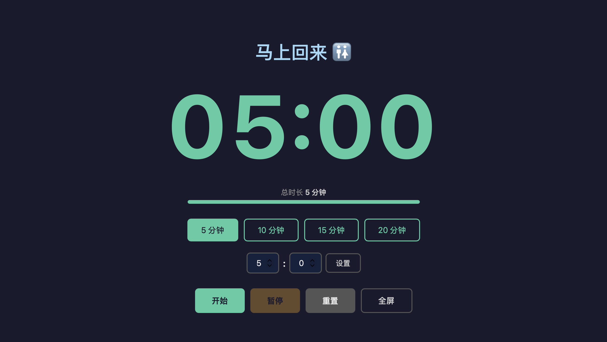

# 占座计时器

会议室占座时临时离开（上厕所、接水等），在屏幕上显示倒计时，让路过的人知道你只是短暂离开。

## 使用方式

直接用浏览器打开 `index.html`，无需服务器。

- 点击预设时间或输入自定义时间
- 点「开始」启动倒计时
- 点「全屏」进入大字模式，适合离开后留在屏幕上给外面的人看
- 按**空格键**快速开始/暂停

## 功能

- 大屏倒计时 + 进度条，远处也能看清
- 剩余 ≤1 分钟变黄，≤30 秒变红闪烁
- 顶部留言可点击编辑（自动保存）
- 全屏模式下只显示计时器和进度条，鼠标移动短暂显示控制栏
